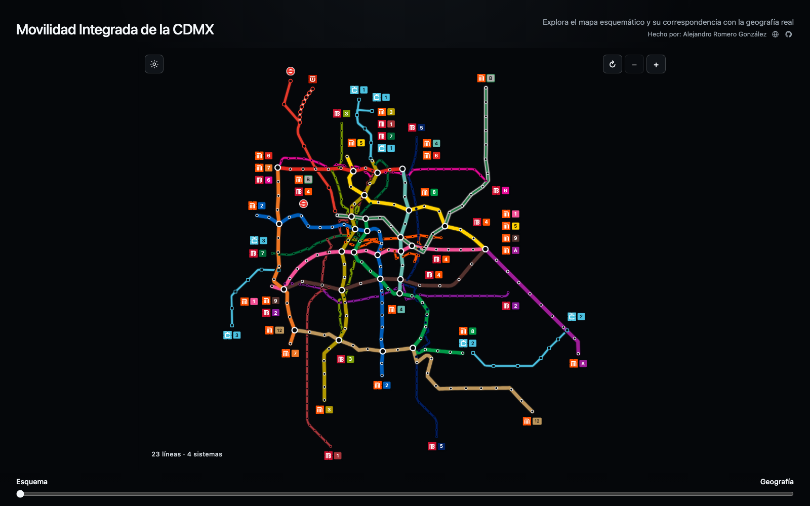

<div align="center">
  <h1>Movilidad Integrada de la CDMX</h1>
  <p><strong>Una visualización interactiva que conecta el mapa esquemático con la geografía real de la red.</strong></p>
  <p>
    <a href="https://github.com/AlejandroRomeroG/movilidad-integrada-cdmx/actions/workflows/pages/pages-build-deployment"></a>
    <a href="https://alejandroromerog.github.io/movilidad-integrada-cdmx/"></a>
    
    
  </p>
  <p>
    <a href="#qué-permite-explorar">Qué permite explorar</a> ·
    <a href="#cobertura">Cobertura</a> ·
    <a href="#fuentes-y-metodología">Fuentes y metodología</a> ·
    <a href="#inicio-rápido">Inicio rápido</a> ·
    <a href="#arquitectura">Arquitectura</a>
  </p>
</div>

> [!NOTE]
> Este es un proyecto independiente de visualización. No sustituye los mapas, horarios, avisos de servicio ni herramientas oficiales de planeación de viaje.

El proyecto representa Metro, Metrobús, Cablebús y Tren Suburbano en un mismo espacio visual. En lugar de presentar dos mapas separados, interpola continuamente cada estación y cada trazo entre el esquema de Movilidad Integrada y su posición geográfica. Así permite observar qué conserva el diseño diagramático, qué simplifica y cómo se relaciona la red con el territorio metropolitano.

**Sitio público:** [alejandroromerog.github.io/movilidad-integrada-cdmx](https://alejandroromerog.github.io/movilidad-integrada-cdmx/)

<a href="https://alejandroromerog.github.io/movilidad-integrada-cdmx/">
  
</a>

## Qué permite explorar

| Capacidad | Qué aporta |
| --- | --- |
| **Esquema ↔ geografía** | Un control continuo muestra cómo cambia la posición de estaciones y líneas entre el plano integrado y el territorio real. |
| **Red multimodal** | Reúne 23 líneas de cuatro sistemas y conserva colores, identificadores y transbordos. |
| **Estaciones** | Cada nodo abre un popup con el nombre y el pictograma de su estación. Los nodos coincidentes pueden recorrerse con clics o toques sucesivos. |
| **Navegación** | Incluye paneo, zoom suave, rueda, doble clic, gesto de pellizco y restablecimiento de la cámara. |
| **Contexto territorial** | La vista geográfica incorpora límites administrativos de la CDMX y de los municipios del Estado de México alcanzados por la red. |
| **Diseño adaptativo** | Funciona en escritorio y dispositivos táctiles, con temas claro y oscuro y respeto por la preferencia de movimiento reducido. |

## Cobertura

| Sistema | Líneas | Cobertura representada |
| --- | ---: | --- |
| **Metro** | 12 | Líneas 1–9, 12, A y B |
| **Metrobús** | 7 | Líneas 1–7 |
| **Cablebús** | 3 | Líneas 1–3 |
| **Tren Suburbano** | 1 | Buenavista–Cuautitlán y ramal al AIFA |
| **Total** | **23** | **4 sistemas** |

El GTFS incorporado corresponde al **24 de febrero de 2026**. La visualización es estática: no muestra posiciones de vehículos, incidencias ni cambios de servicio en tiempo real.

## Controles

| Acción | Escritorio | Dispositivo táctil |
| --- | --- | --- |
| Desplazar el mapa | Arrastrar | Arrastrar con un dedo |
| Acercar o alejar | Rueda, doble clic o botones `−` / `+` | Pellizcar o usar los botones `−` / `+` |
| Restablecer la vista | Botón `↻` | Botón `↻` |
| Consultar una estación | Pasar el puntero o hacer clic sobre el nodo | Tocar el nodo |
| Recorrer nodos coincidentes | Repetir el clic en el mismo punto | Repetir el toque en el mismo punto |
| Cambiar de representación | Mover el control **Esquema–Geografía** | Mover el control **Esquema–Geografía** |

## Fuentes y metodología

| Componente | Fuente o tratamiento |
| --- | --- |
| **Geometría esquemática** | [Mapa de Movilidad Integrada STC 2025](https://www.semovi.cdmx.gob.mx/storage/app/media/MI%20MAPA/Mapa%20MI_STC%202025.pdf), publicado por la Secretaría de Movilidad de la Ciudad de México. |
| **Rutas y estaciones** | [GTFS estático de la Ciudad de México](https://datos.cdmx.gob.mx/dataset/gtfs), con corte al 24 de febrero de 2026. |
| **Ramal al AIFA** | Información pública de conectividad del [Tren Felipe Ángeles](https://www.aifa.aero/conectividad/tren). |
| **Límites administrativos** | [Marco Geoestadístico](https://www.inegi.org.mx/temas/mg/) del INEGI para el contexto territorial. |

Cada estación conserva dos coordenadas: una extraída o reconstruida a partir del esquema oficial y otra derivada de su ubicación geográfica. El deslizador interpola ambas posiciones y actualiza las rutas en SVG. En el esquema, las estaciones se distribuyen de forma regular a lo largo de cada línea; en la geografía, los trazos siguen las formas del GTFS.

Los datos, geometrías e iconos necesarios para la experiencia pública están incorporados en el documento HTML. El navegador no necesita solicitar una API durante la interacción.

## Inicio rápido

No hay dependencias de ejecución ni proceso de compilación. Basta con servir los archivos estáticos desde un servidor local:

```bash
git clone https://github.com/AlejandroRomeroG/movilidad-integrada-cdmx.git
cd movilidad-integrada-cdmx
python3 -m http.server 8000
```

Después abre [http://localhost:8000](http://localhost:8000) en el navegador.

## Arquitectura

| Ruta | Responsabilidad |
| --- | --- |
| `index.html` | Aplicación autocontenida: estructura, estilos, lógica, datos, geometrías e iconos. |
| `.github/assets/mapa-esquematico.png` | Vista previa utilizada por este README. |
| `.nojekyll` | Indica a GitHub Pages que publique los archivos sin procesamiento de Jekyll. |
| `README.md` | Documentación, fuentes y guía de uso local. |

La aplicación usa HTML, CSS y JavaScript nativos. El mapa se renderiza con SVG y las interacciones unifican mouse, lápiz y tacto mediante Pointer Events. No emplea frameworks ni dependencias de ejecución.

## Privacidad y accesibilidad

- La aplicación no incorpora formularios, analítica, publicidad ni rastreadores propios.
- La única preferencia persistente es el tema visual, guardado localmente en el navegador.
- Los controles incluyen nombres accesibles y estados anunciables para tecnologías de asistencia.
- Las animaciones respetan `prefers-reduced-motion`.
- El diseño considera áreas seguras, orientación vertical y horizontal y distintos tamaños de pantalla.
- La consulta de estaciones depende actualmente de mouse, lápiz o tacto; la navegación completa de nodos mediante teclado todavía no está disponible.

## Alcance y límites

- La cercanía o longitud de un tramo en el esquema no representa distancia ni tiempo de viaje.
- La vista geográfica sirve para comparar la red con el territorio; no es un planificador de rutas.
- El contenido refleja un corte de datos y no se actualiza automáticamente cuando cambian estaciones, trazos u operaciones.
- Los nombres, logotipos y pictogramas de los sistemas pertenecen a sus respectivos titulares y se muestran únicamente con fines de identificación.
- El proyecto no está afiliado con el Gobierno de la Ciudad de México, SEMOVI, STC Metro, Metrobús, Cablebús, Ferrocarriles Suburbanos o AIFA.

## Autor

Creado y mantenido por **Alejandro Romero González**.

- Sitio personal: [alejandroromerog.github.io](https://alejandroromerog.github.io/)
- GitHub: [@AlejandroRomeroG](https://github.com/AlejandroRomeroG)
